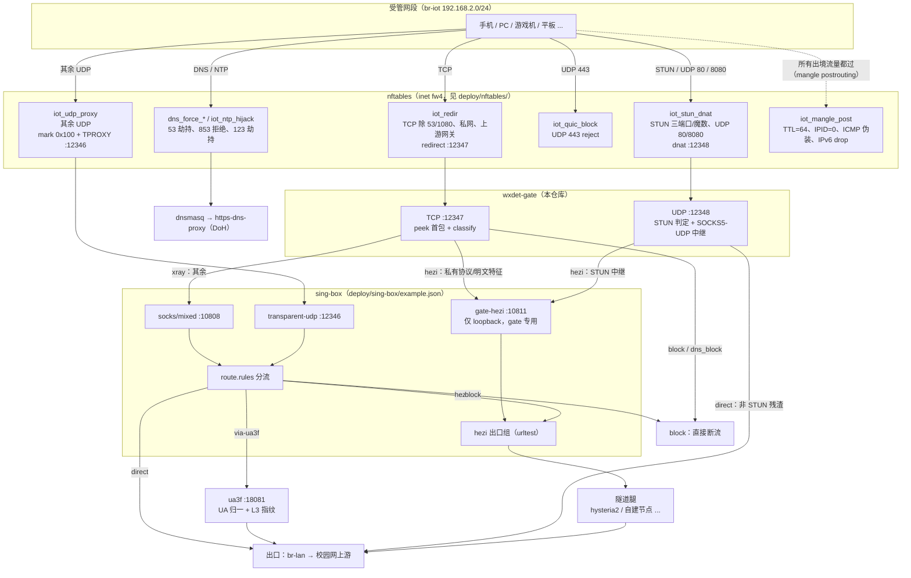

# campus-device-bypass

校园网多设备检测环境下，一套 OpenWrt 旁路网关的分流参考实现。

核心是一个前置分流门 **`wxdet-gate`**（Go，无第三方依赖）：nftables 把受管网段的
流量劫持进来，它 peek 首包、按私有协议指纹与明文特征判定去向 —— 会被校园网
识别为"多设备/路由共享"的流量送进加密入口，其余交给代理核心做精细化分流。

> 背景补充（推荐先读）：[docs/detection-and-countermeasures.md](docs/detection-and-countermeasures.md)
> —— 校园网多设备检测的 11 类手段、厂商实现，以及本方案逐项对应的对抗位置与边界。

## 特性

- **协议指纹分流**：MMTLS / OICQ / 腾讯 MSF 各变种 / TCP-STUN / STUN-over-UDP 等
  无域名可匹配的私有协议，首包即判，全部进加密上行（fail-closed）。
- **明文特征分流**：明文 HTTP 的下载站 Host、下载器 UA/后缀/Range、BSF 信令，
  按策略直连/走代理出口；关键词命中即进隧道。
- **加密 DNS 封堵**：DoH 域名/IP 双名单 + SNI 正则兜底，443 命中即断流。
- **UDP 分流**：nft DNAT 进来的 STUN / UDP 80 / UDP 8080 由 gate 判定，
  STUN 形状全量中继进隧道，assoc 失败 fail-closed。
- **名单热加载**：30 秒按 mtime/size 热更新，不断连接；进程内存占用按小内存
  路由器调优（`GOGC=40 GOMEMLIMIT=16MB` 起步）。
- **完整事件流**：`events.jsonl` 记录每条连接的开/关/错误与字节数，供观测归因。

## 目录

```
gate/            Go 源码（核心，含单测）
deploy/
  init.d/        procd 启停脚本（wxdet-gate、TPROXY 策略路由）
  nftables/      分流/指纹/DNS 的 nft 片段（放入 /etc/nftables.d/）
  sing-box/      代理核心最小接入示例 + 说明
  ua3f/          UA 归一 / L3 指纹复写示例配置
lists/           名单样例与格式说明（gate.kw / dl-* / bsf / doh-*）
docs/            多设备检测与对抗补充文档
```

## 1. 背景与设计思路

校园网的"多设备检测"本质是在一个账号/IP 的流量里找**多台设备、多种 OS、
多个应用账号**的痕迹；常见信号有 TTL、HTTP UA、IPID、应用层 DPI（微信/QQ/应用
商店行为）、UDP 会话数等（详见补充文档）。

应对有两条主线：

1. **收敛**：让出口看起来像"一台设备" —— TTL 统一、UA 归一、IPID 归零、
   NTP/DNS 收敛、TCP 指纹整理（本仓库 `deploy/nftables` + `deploy/ua3f`）。
2. **隐藏**：仍带识别价值的流量整体进加密隧道，让链路层看不见内容与协议特征
   （本仓库 gate 的职责：**决定哪些流量必须进隧道**）。

为什么不能只靠代理核心的域名规则？因为大量高价值流量**没有域名可匹配**：

- 私有协议帧（MMTLS/OICQ/MSF/TCP-STUN）不走标准 TLS，嗅探不出 SNI；
- 明文 HTTP 常见 Host 为 IP 字面，域名规则失效；
- 部分客户端首包是二进制握手，域名规则要等包进去才可能命中。

`wxdet-gate` 在 TCP 层 peek 首包直接按协议指纹定路：识别到的发加密上行，
**fail-closed（只许进隧道，隧道全挂宁断流）**；其余原样交给代理核心按路由表
精细分流（直连/改写/隧道），保证吞吐与体验。

## 2. 系统全景

### 2.1 数据面流程图



### 2.2 哪些流量经过 gate，哪些不经过

| 流量 | 路径 | 说明 |
|---|---|---|
| TCP（除 53/1080、私网、上游网关目的） | `iot_redir` → **gate TCP :12347** | gate 判定后：`hezi` 进隧道 / `xray` 交给 sing-box / `block` 断流 |
| STUN（三端口 + 任意端口魔数）、UDP 80、UDP 8080 | `iot_stun_dnat` → **gate UDP :12348** | gate 判定 STUN 形状；`hezi` 走 SOCKS5-UDP 中继 |
| 其余 UDP | `iot_udp_proxy` → sing-box `transparent-udp :12346` | 不经 gate；sing-box 按 IP/端口路由，默认直连 |
| UDP 443（QUIC） | `iot_quic_block` reject | 不经 gate；逼客户端回落 TCP，才能进代理链 |
| DNS（53）、DoT（853）、NTP（123） | `dns_force_*` / `iot_ntp_hijack` → 本机 dnsmasq/NTP | 不经 gate；上游 DoH，被封的加密 DNS 由 gate+sing-box 名单兜住 |
| 私网互访、发往上游网关的管理流量 | 直接放行 | 不经 gate |
| 所有出境包的 L3 收尾 | `iot_mangle_post`（TTL=64、IPID=0 等） | 不经 gate；受管网段全部流量生效 |

### 2.3 出口

- **隧道流量**：gate / sing-box 拨到 `hezi` 出口组（本机 hysteria2 腿 + 远程
  VLESS 腿，urltest 自动选路与故障转移），从自建节点封包出境。
- **直连/改写流量**：sing-box `direct` 直发；`via-ua3f` 经本机 ua3f SOCKS5
  重建连接（UA 归一 + L3 指纹复写）后发出。
- **出口前统一处理**：出 `br-lan` 前 nft 统一 TTL/IPID、ICMP 伪装；
  本机发起的 TCP SYN 还过 ua3f 的 NFQUEUE 钩子做 TCP 指纹整理。

## 3. wxdet-gate 工作原理

### 3.1 TCP 判定（`gate/main.go` `classify`，按代码顺序）

| # | 条件（首包特征） | verdict/reason | 去向 |
|---|---|---|---|
| 1 | 443 且目的 IP ∈ DoH 解析器 IP 名单 | `block/dns_block` | 断流 |
| 2 | `b[1]==0xF1` 且 `b[0]∈{0x15,0x16,0x17,0x19}`（MMTLS/微信长连接） | `hezi/mmtls` | 隧道 |
| 3 | `b[0]==0x02`（OICQ 握手） | `hezi/oicq` | 隧道 |
| 4 | MSF u16be 家族：`b[2:4]==08 00`、`b[4]∈{06,07,08}`、`b[5:8]==06 07 62`、长度自洽 | `hezi/msf` | 隧道 |
| 5 | MSF `TYPE_COMPRESS` 变种：`08 00` + offset 7 起 13 字节 ASCII 魔串、长度自洽 | `hezi/msf` | 隧道 |
| 6 | MSF u32be 变种：`u32be len + 01 33 52 39 + u32be 0 + 04 "MSF"` | `hezi/msf` | 隧道 |
| 7 | MSF 全零头变种：`00 00 00 len 00 00 00 c8` | `hezi/msf` | 隧道 |
| 8 | MSF 0806 变种：`08 XX 08 00 07 06 0c 73` | `hezi/msf` | 隧道 |
| 9 | TCP-STUN：长度前缀 + `00 01` + magic `21 12 a4 42`、长度自洽 | `hezi/stun` | 隧道 |
| 10 | TLS ClientHello 且 SNI ∈ DoH 名单/正则 | `block/dns_block` | 断流 |
| 11 | TLS ClientHello（其余） | `xray/tls_direct` | 代理核心 |
| 12 | 明文 HTTP 且 Host ∈ 下载站名单 | `xray/dl_direct` | 代理核心 |
| 13 | 明文 HTTP 且 UA 命中关键词（如 aweme、micromessenger） | `hezi/http_ua_kw` | 隧道 |
| 14 | 明文 HTTP 且 Host/请求行命中关键词（微信/抖音/QQ 域等） | `hezi/http_host_kw`、`http_path_kw` | 隧道 |
| 15 | 明文 HTTP 且带 `Range:` 头（下载器/续传特征） | `xray/dl_range` | 代理核心 |
| 16 | 明文 HTTP 且 UA 命中下载器 token | `xray/dl_ua` | 代理核心 |
| 17 | 明文 HTTP 且 URL 后缀为二进制/媒体 | `xray/dl_ext` | 代理核心 |
| 18 | 明文 HTTP 且 Host 为 BSF/RCS 信令域 | `xray/bsf_direct` | 代理核心 |
| 19 | 明文 HTTP 通判（方法行合法、未命中以上） | `hezi/http_plain`（逃生开关可回退 `xray`） | 隧道 |
| 20 | `:80` 空载荷/静默/非 HTTP | `hezi/port80`（逃生开关可回退 `xray`） | 隧道 |
| 21 | 端口 8000–9000 的非 TLS 残渣 | `hezi/default` | 隧道 |
| 22 | 其余 | `xray/default` | 代理核心 |

补充行为：

- **`:80` 短读**：`WD_PEEK80_MS`（默认 80ms）opportunistic 短读 —— 客户端建连即发
 请求，局域网内必在途；读到即正常判定，静默/非 HTTP 则 `port80` fail-closed。
- **静默复用**：非 80 的静默连接，若目的端点曾判定过 `hezi`，复用原 reason 进
  隧道（12 小时记忆、上限 2048 条）；未知端点仍 `xray/default` 交代理核心。
- **逃生开关**：`touch /etc/wxdet/no-plainhttp-hezi`（或 `WD_NO_PLAINHTTP_HEZI`
  指向的文件）后，只把"明文通判 + 80 短路"两类回退给代理核心；
  关键词/下载站/BSF/私有协议指纹**不受影响**（reason 字符串不变，只是换去向）。
- **源地址可归因**：gate 拨向代理核心的 `xray` 流量会绑定
  `127.0.0.<客户端末位>:<客户端源端口>` 作为本地源，便于在代理核心日志里关联回
  原始客户端（不影响转发语义）。

### 3.2 UDP 判定（`gate/udp.go`）

- **取真实目的**：`IP_RECVORIGDSTADDR` + `recvmsg` 逐包从 cmsg 取 DNAT 前的
  目的地址。注意：`SO_ORIGINAL_DST` 在未连接的 UDP 监听套接字上恒
  `EPROTONOSUPPORT`，不要回退到它。
- **判定规则**：

| 条件 | verdict/reason | 去向 |
|---|---|---|
| dport == 80 | `hezi/port80_udp` | 隧道 |
| 标准 STUN 魔数 `21 12 a4 42` + 首 2bit 为 0 | `hezi/stun_udp` | 隧道 |
| 变种 STUN（`0001/0101` 包型，事务配对） | `hezi/stun_udp_var` | 隧道 |
| 端口 8000–9000 的非 STUN 残渣 | `hezi/default` | 隧道 |
| 短包（<20B）/其余 | `direct/udp_short`、`udp_direct` | 直连回源 |

- **中继语义**：`verdict==hezi` 即中继（经 `hezi` 出口组的 SOCKS5-UDP associate）；
  **assoc 失败即丢包（fail-closed），不回退直连**。非 STUN 残渣直连回源
  （fail-open，保持普通 UDP 体验）。
- **状态表**：按 `客户端 + 目的` 维护 assoc，空闲 120s 回收，上限 512 条，
  防环丢弃 loopback/私网/链路本地目的。

### 3.3 术语对照（重要）

| 字符串 | 含义 |
|---|---|
| `hezi` | 参考部署对"加密上行出口组"的代号（sing-box `hezi` urltest 组）。代码/日志沿用它；可以换成你的任意命名，但改字符串会牵动日志消费方 |
| `xray` | **历史命名**：语义是"交给代理核心按路由表选出口"，不是真的 xray。env 名 `WD_XRAY_SOCKS` 同理 |
| `direct` | 直连回源（UDP 判定用） |
| `block` | 政策阻断（加密 DNS 等），直接断流 |
| `port80` / `port80_udp` | `:80` 短读静默/非 HTTP 的 fail-closed 判定 |
| `dl_*` / `bsf_direct` | 下载站/下载器/运营商信令的 direct-by-policy |
| `*_hezi_fail` | 隧道拨号失败；fail-closed，不回退 |

### 3.4 名单与热加载

- 文件（`/etc/wxdet/`，路径可用 `WD_*_FILE` 覆盖）：`gate.kw`、
  `dl-domains.txt`、`dl-ua.txt`、`dl-ext.txt`、`bsf-domains.txt`、
  `doh-domains.txt`、`doh-ips.txt`。格式见 [lists/README.md](lists/README.md)。
- 30 秒轮询 mtime/size（`WD_KW_POLL_SEC`），变化即原子替换内存快照，
  **不断开已有连接、不需要重启**；单个文件缺失/读取失败保留旧快照。
- DoH IP 名单以内置常见解析器种子为基线，文件只增不减。

### 3.5 观测

`/tmp/wxdet/` 下三份文件（路径可配置）：

- `gate.log`：每条连接一行 JSON（`ts/src/dst/verdict/reason/first`，`first` 为首包
  前 24 字节 hex）。
- `stats.tsv`：`unix_ts <tab> 计数键 <tab> 值` 的追加计数（`gate_conn`、
  `gate_hezi`、`gate_hezi_fail`、`gate_rsn_<reason>`、`gate_udp_assoc` 等）。
- `events.jsonl`：统一事件流，字段如下：

| event | 字段 |
|---|---|
| `open` | `ts, event, proto, src, dst, verdict, reason` |
| `close` | `…, dur_ms, up_B, down_B, closer`（>60s 加 `long:1`） |
| `uclose` | `…, dur_ms, up_pkts, down_pkts, up_B, down_B` |
| `error` | `…, verdict:"err", reason, detail` |

> `xray/tls_direct` 这类大流量普通连接只进 `stats.tsv` 计数、不进事件流，
> 避免观测文件被冲爆。

## 4. 快速开始

### 4.1 拓扑与依赖

参考拓扑：路由器作**旁路网关**（本机 LAN IP + 一个受管网段接口），上游是校园网
网关。受管设备连在受管网段（示例 `192.168.2.0/24`）。

依赖组件（都可替换）：

- [sing-box](https://github.com/SagerNet/sing-box)（或同形态代理核心）：路由与出口组；
- 一条加密隧道（示例：本机 hysteria2 客户端 + 远程 VLESS 节点）；
- [UA3F](https://github.com/SunBK201/UA3F)（可选但推荐）：UA/L3 指纹归一；
- nftables（fw4）、dnsmasq、https-dns-proxy 等 OpenWrt 原生件。

### 4.2 编译与安装

```sh
make            # gofmt + go vet + go test + 本机构建（产物 gate/wxdet-gate）
make arm64      # 交叉编译 linux/arm64

# 部署到路由器（替换 <router>）
scp gate/wxdet-gate            root@<router>:/usr/bin/wxdet-gate
scp deploy/init.d/wxdet-gate   root@<router>:/etc/init.d/wxdet-gate
ssh root@<router> 'chmod 755 /etc/init.d/wxdet-gate && /etc/init.d/wxdet-gate enable && /etc/init.d/wxdet-gate start'

# 名单（按需裁剪后放好）
scp lists/gate.kw.example      root@<router>:/etc/wxdet/gate.kw
scp lists/dl-domains.example   root@<router>:/etc/wxdet/dl-domains.txt
# …其余文件同理，见 lists/README.md
```

### 4.3 nftables 接入

```sh
scp deploy/nftables/*.nft root@<router>:/etc/nftables.d/
ssh root@<router> 'fw4 reload'   # 首次接入整体加载一次
```

注意：

- 先把 sing-box / 隧道起好**再**接入重定向，否则流量会 fail-closed 断流；
- 首次 `fw4 reload` 之后，日常改动优先用 `nft add/delete rule` 热修 + 同步文件，
  避免反复 reload 清零全部计数器（破坏观测基线）；
- `deploy/nftables/README.md` 有每条规则的说明与依赖（策略路由、flow offloading
  必须关闭等）；
- `deploy/nftables/31-gate-udp.nft` 依赖 `deploy/init.d/iot-tproxy` 的策略路由。

### 4.4 sing-box 接入

`deploy/sing-box/example.json` 是最小可跑骨架：gate-hezi 入站、hezi 出口组、
via-ua3f 出口、路由规则顺序全部保留语义。接入步骤与细节：
[deploy/sing-box/README.md](deploy/sing-box/README.md)。

```sh
mkdir -p /tmp/wxdet
sing-box check -c /etc/sing-box/config.json
/etc/init.d/sing-box restart
```

### 4.5 ua3f 接入（可选但推荐）

`deploy/ua3f/ua3f.example` 给出"作为 SOCKS5 上游 + L3 指纹整理"的配置形态
（UA 全量归一、去时间戳、窗口统一等）。UA3F 自带 NFQUEUE 钩子会处理本机发起的
TCP SYN，安装方式见上游文档。

### 4.6 验证

```sh
# 1) gate 起来了 / 名单加载
ssh root@<router> 'logread | grep wxdet-gate | tail'
ssh root@<router> 'tail /tmp/wxdet/gate.log; tail -3 /tmp/wxdet/stats.tsv'

# 2) nft 计数器在动（redirect/tproxy 命中）
ssh root@<router> 'nft list chain inet fw4 iot_redir; nft list chain inet fw4 iot_stun_dnat'

# 3) 端到端：经 10808 出口访问
curl -x socks5h://127.0.0.1:10808 -sS -o /dev/null -w '%{http_code}\n' https://example.com
```

### 4.7 观测速查

```sh
tail -f /tmp/wxdet/gate.log          # 逐连接 verdict/reason
awk -F'\t' '{c[$2]+=$3} END{for(k in c) print c[k],k}' /tmp/wxdet/stats.tsv | sort -rn | head
tail -5 /tmp/wxdet/events.jsonl      # 统一事件流
```

## 5. 配置项（环境变量）

| 变量 | 默认 | 说明 |
|---|---|---|
| `WD_LISTEN` | `0.0.0.0:12347` | TCP 门监听地址 |
| `WD_UDP_LISTEN` | `0.0.0.0:12348` | UDP 门监听地址；`off`/空 关闭 UDP 门 |
| `WD_XRAY_SOCKS` | `127.0.0.1:10808` | 代理核心入口（历史命名），`xray` verdict 的拨号目标 |
| `WD_HEZI_SOCKS` | `127.0.0.1:10811` | `hezi` verdict 的拨号目标（sing-box `gate-hezi` 入站） |
| `WD_DOH_DOM_FILE` / `WD_DOH_IP_FILE` | `/etc/wxdet/doh-domains.txt` / `doh-ips.txt` | 加密 DNS 封堵名单 |
| `WD_KW_FILE` | `/etc/wxdet/gate.kw` | 关键词表 |
| `WD_DL_DOM_FILE` / `WD_DL_UA_FILE` / `WD_DL_EXT_FILE` / `WD_BSF_DOM_FILE` | `/etc/wxdet/dl-*.txt` / `bsf-domains.txt` | 下载站/下载器/BSF 名单 |
| `WD_NO_PLAINHTTP_HEZI` | `/etc/wxdet/no-plainhttp-hezi` | 逃生开关（存在即回退明文通判与 80 短路） |
| `WD_PEEK_MS` | `400` | 非 80 首包等待（ms） |
| `WD_PEEK80_MS` | `80` | `:80` opportunistic 短读（ms） |
| `WD_KW_POLL_SEC` | `30` | 名单轮询周期（秒），`<=0` 关闭 |
| `WD_LOG` / `WD_STATS` / `WD_EVENTS` | `/tmp/wxdet/gate.log` / `stats.tsv` / `events.jsonl` | 观测输出 |
| `WD_UDP_FIXED_DST` | 空 | 调试用：跳过 origdst，固定中继目的（生产勿设） |

## 6. 排障 FAQ

**Q：判 `hezi` 的流量为什么断流而不是回退直连？**
设计如此（fail-closed）：这些流量靠协议特征暴露多设备/账号信号，直连等于自曝；
隧道组全挂时宁断流。恢复隧道（检 `:18082` 侦听/远程节点）即恢复。

**Q：隧道全挂后整个受管网段都上不了网？**
不会全断：只有被判 `hezi`/`block` 的流量受影响，`xray` 类（TLS/下载等）走代理
核心直连仍可用；但 `hezi` 类会持续失败直到隧道恢复。应急可先摘掉重定向链：
`nft flush chain inet fw4 iot_redir`（再 `nft flush chain inet fw4 iot_stun_dnat`），
停 gate 服务，等修复后再接回。

**Q：能不能先只观察不改流量？**
可以：只跑 gate（不接 nft 重定向）用 `WD_UDP_FIXED_DST`/`WD_PEEK_MS` 调试，
或接上重定向但用逃生文件观察明文通判回退情况。正式接入前建议先小范围验证。

**Q：端口容易搞混。**
本方案：`10808` = 代理核心通用 SOCKS（**socks5h** 用）；`10811` = gate 专用
loopback 入站；`12346` = UDP TPROXY；`12347/12348` = gate TCP/UDP。
注意 scheme 要对：把 `socks5h://` 打到 HTTP 代理上会得到
`malformed HTTP request` + 超时，是假故障。

**Q：名单改了要重启吗？**
不用。30 秒内自动热加载；只有 sing-box 侧路由（下载站 `via-ua3f`、DoH block、
hezi 尾段）需要按你的配置方式重新生成并 restart 代理核心。

**Q：观测文件会不会无限涨？**
项目本身不做轮转：`stats.tsv`/`events.jsonl`/`gate.log` 的轮转与截断由系统
logrotate/cron 自理。注意**截断保持 inode**（`cat tmp > f` / `: > f`），
消费方若按"行数游标"增量读，换 inode 会被当成新文件重读。

**Q：内存/CPU 占用？**
gate 是纯转发进程，Go 运行时按小内存路由器调优（示例 `GOGC=40`、
`GOMEMLIMIT=16MB`）。CPU 消耗主要来自 peek 等待与 SHA 无涉的字节匹配，开销很小；
大头在代理核心与隧道。

## 7. 多设备检测对抗（摘要）

| 检测项 | 本方案对应 |
|---|---|
| TTL / IPID / ICMP | `32-egress-fingerprint.nft`：TTL=64、IPID=0、ICMP 伪装、IPv6 drop |
| HTTP UA / TLS 指纹 | `via-ua3f` 出口 + ua3f `l3_rewrite_*`（UA 归一、去时间戳、窗口统一） |
| NTP | `33-dns-ntp.nft`：UDP 123 劫持到本机 |
| DNS/DoH 画像 | 53 劫持到 dnsmasq→DoH、853 拒绝、DoH 名单封堵（gate + sing-box） |
| DPI 应用特征（微信/QQ/抖音/游戏） | gate 协议指纹 + 名单 → `hezi` 加密上行组 |
| UDP 会话/STUN | `31-gate-udp.nft` + gate STUN 判定与中继 |
| QUIC 绕过 | `iot_quic_block` 拒绝，逼回 TCP 进代理链 |
| 私有客户端心跳 | 不在本仓库范围（认证层问题） |

完整原理、厂商实现与边界讨论见
[docs/detection-and-countermeasures.md](docs/detection-and-countermeasures.md)。

## 8. 合规与风险

- 绕过校园网的多设备限制/计费策略通常**违反学校网络管理规定**，可能触发断网、
  限速、冻结账号等处罚；请在自有或获授权的网络中、以学习与研究为目的使用。
- 本方案会改写指纹、封堵加密 DNS、拒绝 QUIC，可能影响个别应用（银行/政务
  App 对 DNS 劫持敏感）；上量前先观察日志、灰度验证。
- 任何"收敛/伪装"都不保证对所有检测维度有效；检测强度会升级，风险自负。

## 9. 维护说明

本仓库是参考部署的**公开发行版**：`gate/` 与上游私有部署版本保持逻辑级同步
（公开整理只动注释，不动作息），部署示例按公开可复现原则做了命名与脱敏处理。
四份区域（`gate/`、`deploy/`、`lists/`、`docs/`）各自独立演进，改动建议附测试
（`make` 会跑 gofmt/vet/test）。

## 10. 致谢

- [SagerNet/sing-box](https://github.com/SagerNet/sing-box) —— 代理核心与路由；
- [SunBK201/UA3F](https://github.com/SunBK201/UA3F) —— UA/L3 指纹归一；
- [apernet/hysteria](https://github.com/apernet/hysteria) —— 隧道实现之一；
- [dibdot/DoH-IP-blocklists](https://github.com/dibdot/DoH-IP-blocklists)、
  [Sekhan/TheGreatWall](https://github.com/Sekhan/TheGreatWall) —— DoH 名单上游。

## License

[MIT](LICENSE)
